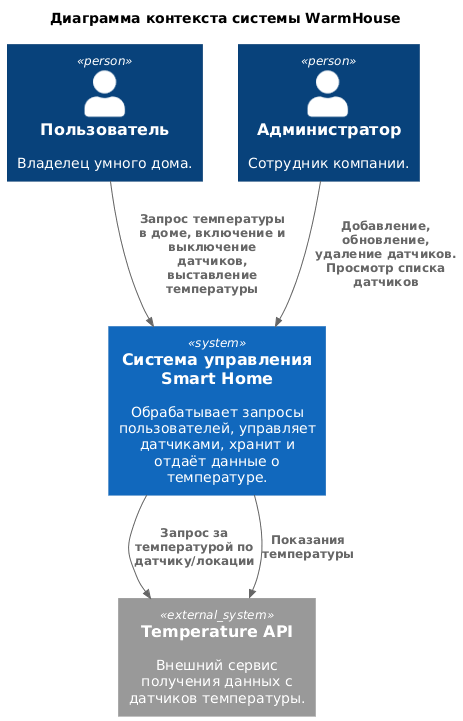
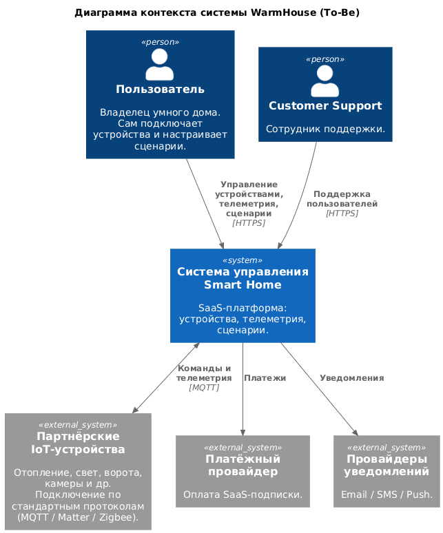
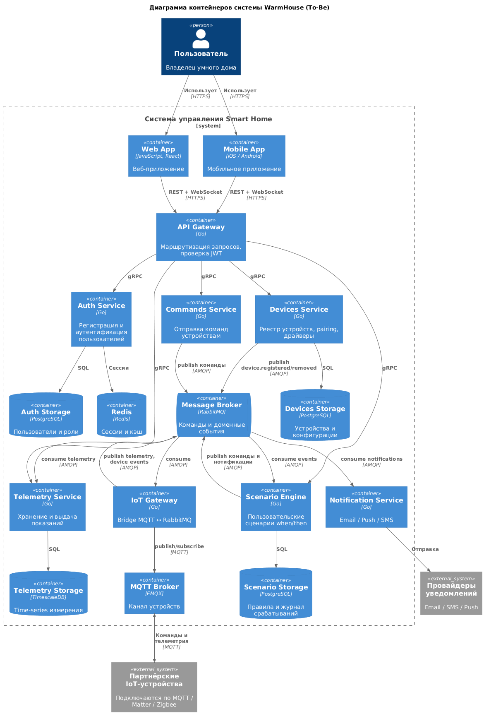
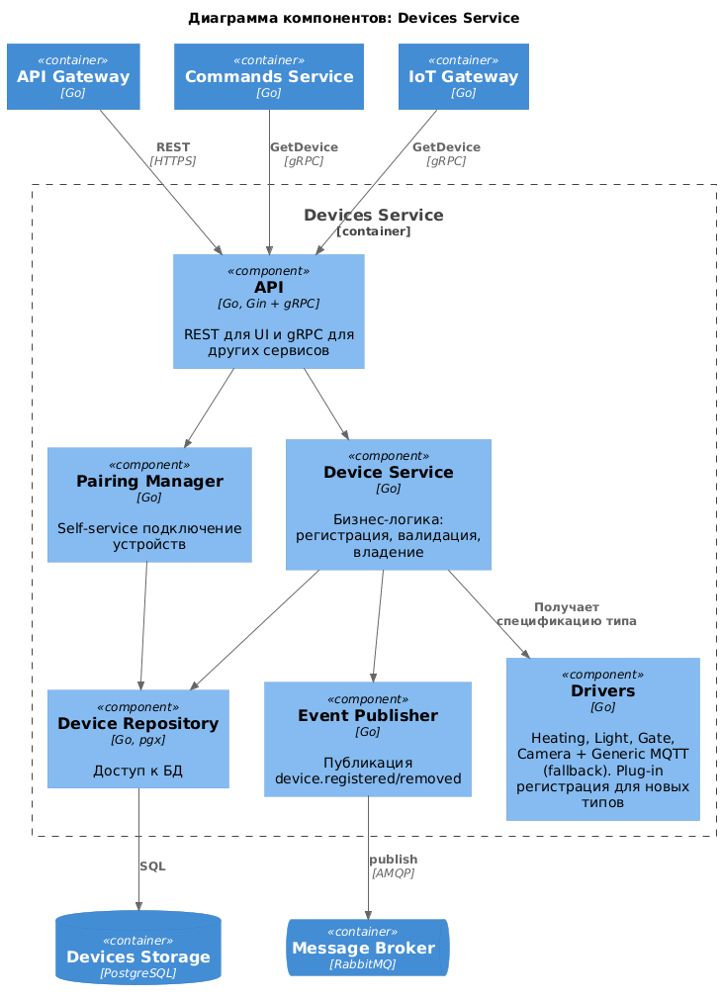
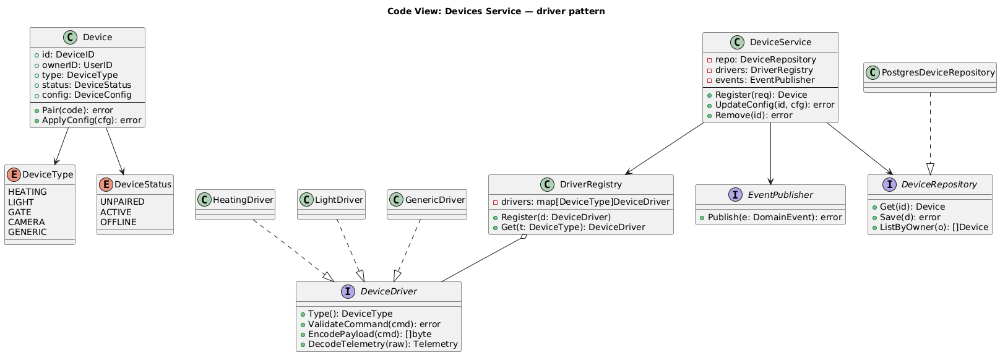

# Задание 1. Анализ и планирование

### 1. Описание функциональности монолитного приложения

**Управление отоплением:**

- Пользователи могут удалённо включать/выключать отопление в своих домах и выставлять температуру отопления через веб-интерфейс
- Система поддерживает обновление температуры и статуса датчиков

**Мониторинг температуры:**

- Пользователи могут просматривать текущую температуру в своих домах через веб-интерфейс
- Система поддерживает получение данных о температуре с датчиков, установленных в домах

**Управление датчиками:**
- Сотрудники компании могут добавлять, обновлять и удалять датчики через веб-интервейс
- Сотрудники компании могут просматривать список всех датчиков через веб-интерфейс
- Сотрудники компании могут получать информацию о датчике по id
- Система поддерживает хранение, обновление и удаление датчиков в базе данных
- Система поддерживает получение списка датчиков и информацию о датчике по id

### 2. Анализ архитектуры монолитного приложения

Язык программирования: Go
Фреймворк: Gin
База данных: PostgreSQL
Архитектура: Монолитная, все компоненты системы (обработка запросов, бизнес-логика, работа с данными) находятся в рамках одного приложения.
Взаимодействие: Синхронное, запросы обрабатываются последовательно.
Масштабируемость: Ограничена, так как монолит сложно масштабировать по частям.
Развертывание: Требует остановки всего приложения.

### 3. Определение доменов и границы контекстов
* Домен: Умный дом
  * Поддомен: Управление датчиками
    * Контекст: Добавление/обновление/удаление датчиков
    * Контекст: Включение/выключение и установка температуры на датчик
  * Поддомен: Мониторинг температуры
    * Контекст: Получение температуры с датчиков
* Домен: Пользователи
  * Поддомен: Активациия
    * Контекст: Регистрация новых пользователей и локаций
  * Поддомен: Авторизация и аутентификация
    * Контекст: Авторизация пользователей
    * Контекст: Проверка прав пользователя

### **4. Проблемы монолитного решения**

- **Единая точка отказа.** Сбой любого компонента может привести к отказу всего приложения.

- **Невозможность независимого масштабирования.** Если нагрузка на чтение телеметрии вырастет в 10 раз, а управление устройствами останется на прежнем уровне, масштабировать придётся всё приложение целиком, тратя ресурсы впустую.

- **Тесная связанность доменов (tight coupling).** Домены Device Management и Telemetry сосуществуют в одной кодовой базе, общей БД и одних и тех же структурах данных (`Sensor` содержит и реестровые поля, и показания). Изменение в одном домене рискует затронуть другой.

- **Развёртывание требует остановки всего приложения.** Даже мелкое исправление в логике получения температуры требует пересборки и перезапуска всего монолита, включая управление устройствами.

- **Синхронная зависимость от внешнего сервиса.** При запросе списка датчиков (`GET /sensors`) монолит последовательно опрашивает Temperature API для каждого температурного датчика. При N датчиках это N HTTP-запросов, блокирующих ответ пользователю. Нет кэширования, circuit breaker'а или fallback-стратегии.

- **Одна база данных, одна таблица.** Все данные хранятся в единственной таблице `sensors`. Нет истории измерений, нет возможности выбрать оптимальное хранилище для каждого типа данных (например, TimescaleDB для телеметрии).

- **Отсутствие асинхронного взаимодействия.** Все операции выполняются синхронно. Нет очередей сообщений или событийной модели, что ограничивает возможности для реактивной обработки (например, алерты при превышении пороговой температуры).

### 5. Визуализация контекста системы — диаграмма С4




```markdown
@startuml
!include https://raw.githubusercontent.com/plantuml-stdlib/C4-PlantUML/master/C4_Context.puml

title Диаграмма контекста системы WarmHouse

Person(user, "Пользователь", "Владелец умного дома.")
Person(admin, "Администратор", "Сотрудник компании.")

System(smarthome, "Система управления Smart Home", "Обрабатывает запросы пользователей, управляет датчиками, хранит и отдаёт данные о температуре.")

System_Ext(temp_api, "Temperature API", "Внешний сервис получения данных с датчиков температуры.")

Rel(user, smarthome, "Запрос температуры в доме, включение и выключение датчиков, выставление температуры")
Rel(admin, smarthome, "Добавление, обновление, удаление датчиков. Просмотр списка датчиков")
Rel(smarthome, temp_api, "Запрос за температурой по датчику/локации")
Rel_Back(temp_api, smarthome, "Показания температуры")

@enduml
```

# Задание 2. Проектирование микросервисной архитектуры

**Диаграмма контекста (To-Be)**



```markdown
@startuml
!include https://raw.githubusercontent.com/plantuml-stdlib/C4-PlantUML/master/C4_Context.puml

title Диаграмма контекста системы WarmHouse (To-Be)

Person(user, "Пользователь", "Владелец умного дома. Сам подключает устройства и настраивает сценарии.")
Person(support, "Customer Support", "Сотрудник поддержки.")

System(smarthome, "Система управления Smart Home", "SaaS-платформа: устройства, телеметрия, сценарии.")

System_Ext(partner_devices, "Партнёрские IoT-устройства", "Отопление, свет, ворота, камеры и др. Подключение по стандартным протоколам (MQTT / Matter / Zigbee).")
System_Ext(payment, "Платёжный провайдер", "Оплата SaaS-подписки.")
System_Ext(messaging, "Провайдеры уведомлений", "Email / SMS / Push.")

Rel(user, smarthome, "Управление устройствами, телеметрия, сценарии", "HTTPS")
Rel(support, smarthome, "Поддержка пользователей", "HTTPS")

BiRel(smarthome, partner_devices, "Команды и телеметрия", "MQTT")
Rel(smarthome, payment, "Платежи")
Rel(smarthome, messaging, "Уведомления")

@enduml
```

**Диаграмма контейнеров (Containers)**



```markdown
@startuml
!include https://raw.githubusercontent.com/plantuml-stdlib/C4-PlantUML/master/C4_Container.puml

title Диаграмма контейнеров системы WarmHouse (To-Be)

Person(user, "Пользователь", "Владелец умного дома")

System_Boundary(smarthome, "Система управления Smart Home") {
    Container(web, "Web App", "JavaScript, React", "Веб-приложение")
    Container(mobile, "Mobile App", "iOS / Android", "Мобильное приложение")

    Container(gateway, "API Gateway", "Go", "Маршрутизация запросов, проверка JWT")

    Container(auth, "Auth Service", "Go", "Регистрация и аутентификация пользователей")
    ContainerDb(auth_db, "Auth Storage", "PostgreSQL", "Пользователи и роли")
    ContainerDb(redis, "Redis", "Redis", "Сессии и кэш")

    Container(devices, "Devices Service", "Go", "Реестр устройств, pairing, драйверы")
    ContainerDb(devices_db, "Devices Storage", "PostgreSQL", "Устройства и конфигурации")

    Container(telemetry, "Telemetry Service", "Go", "Хранение и выдача показаний")
    ContainerDb(telemetry_db, "Telemetry Storage", "TimescaleDB", "Time-series измерения")

    Container(commands, "Commands Service", "Go", "Отправка команд устройствам")

    Container(scenario, "Scenario Engine", "Go", "Пользовательские сценарии when/then")
    ContainerDb(scenario_db, "Scenario Storage", "PostgreSQL", "Правила и журнал срабатываний")

    Container(notify, "Notification Service", "Go", "Email / Push / SMS")

    ContainerQueue(rabbit, "Message Broker", "RabbitMQ", "Команды и доменные события")

    Container(iot, "IoT Gateway", "Go", "Bridge MQTT ↔ RabbitMQ")
    Container(mqtt, "MQTT Broker", "EMQX", "Канал устройств")
}

System_Ext(devices_ext, "Партнёрские IoT-устройства", "Подключаются по MQTT / Matter / Zigbee")
System_Ext(messaging_ext, "Провайдеры уведомлений", "Email / SMS / Push")

Rel(user, web, "Использует", "HTTPS")
Rel(user, mobile, "Использует", "HTTPS")

Rel(web, gateway, "REST + WebSocket", "HTTPS")
Rel(mobile, gateway, "REST + WebSocket", "HTTPS")

Rel(gateway, auth, "gRPC")
Rel(gateway, devices, "gRPC")
Rel(gateway, telemetry, "gRPC")
Rel(gateway, commands, "gRPC")
Rel(gateway, scenario, "gRPC")

Rel(auth, auth_db, "SQL")
Rel(auth, redis, "Сессии")
Rel(devices, devices_db, "SQL")
Rel(telemetry, telemetry_db, "SQL")
Rel(scenario, scenario_db, "SQL")

Rel(commands, rabbit, "publish команды", "AMQP")
Rel(rabbit, iot, "consume", "AMQP")
Rel(iot, mqtt, "publish/subscribe", "MQTT")
BiRel(mqtt, devices_ext, "Команды и телеметрия", "MQTT")

Rel(iot, rabbit, "publish telemetry, device events", "AMQP")
Rel(rabbit, telemetry, "consume telemetry", "AMQP")
Rel(rabbit, scenario, "consume events", "AMQP")
Rel(scenario, rabbit, "publish команды и нотификации", "AMQP")
Rel(rabbit, notify, "consume notifications", "AMQP")
Rel(devices, rabbit, "publish device.registered/removed", "AMQP")

Rel(notify, messaging_ext, "Отправка")

@enduml
```

**Диаграмма компонентов (Components)**

Подробная декомпозиция показана для Devices Service — самого нагруженного с точки зрения паттернов сервиса (driver pattern, pairing, event publishing). Остальные сервисы устроены по тому же шаблону: API → бизнес-логика → репозиторий + event publisher.



```markdown
@startuml
!include https://raw.githubusercontent.com/plantuml-stdlib/C4-PlantUML/master/C4_Component.puml

title Диаграмма компонентов: Devices Service

Container(gateway, "API Gateway", "Go")
Container(commands, "Commands Service", "Go")
Container(iot, "IoT Gateway", "Go")
ContainerDb(devices_db, "Devices Storage", "PostgreSQL")
ContainerQueue(rabbit, "Message Broker", "RabbitMQ")

Container_Boundary(devices, "Devices Service") {
    Component(api, "API", "Go, Gin + gRPC", "REST для UI и gRPC для других сервисов")
    Component(service, "Device Service", "Go", "Бизнес-логика: регистрация, валидация, владение")
    Component(pairing, "Pairing Manager", "Go", "Self-service подключение устройств")
    Component(drivers, "Drivers", "Go", "Heating, Light, Gate, Camera + Generic MQTT (fallback). Plug-in регистрация для новых типов")
    Component(repo, "Device Repository", "Go, pgx", "Доступ к БД")
    Component(events, "Event Publisher", "Go", "Публикация device.registered/removed")
}

Rel(gateway, api, "REST", "HTTPS")
Rel(commands, api, "GetDevice", "gRPC")
Rel(iot, api, "GetDevice", "gRPC")

Rel(api, service, "")
Rel(api, pairing, "")
Rel(service, repo, "")
Rel(service, drivers, "Получает спецификацию типа")
Rel(service, events, "")
Rel(pairing, repo, "")

Rel(repo, devices_db, "SQL")
Rel(events, rabbit, "publish", "AMQP")

@enduml
```

**Диаграмма кода (Code)**

UML-диаграмма классов для driver pattern в Devices Service — ключевой механизм расширяемости под новые типы устройств.



```markdown
@startuml
title Code View: Devices Service — driver pattern

class Device {
    +id: DeviceID
    +ownerID: UserID
    +type: DeviceType
    +status: DeviceStatus
    +config: DeviceConfig
    --
    +Pair(code): error
    +ApplyConfig(cfg): error
}

enum DeviceType {
    HEATING
    LIGHT
    GATE
    CAMERA
    GENERIC
}

enum DeviceStatus {
    UNPAIRED
    ACTIVE
    OFFLINE
}

interface DeviceDriver {
    +Type(): DeviceType
    +ValidateCommand(cmd): error
    +EncodePayload(cmd): []byte
    +DecodeTelemetry(raw): Telemetry
}

class HeatingDriver
class LightDriver
class GenericDriver

HeatingDriver ..|> DeviceDriver
LightDriver ..|> DeviceDriver
GenericDriver ..|> DeviceDriver

class DriverRegistry {
    -drivers: map[DeviceType]DeviceDriver
    +Register(d: DeviceDriver)
    +Get(t: DeviceType): DeviceDriver
}

DriverRegistry o-- DeviceDriver

class DeviceService {
    -repo: DeviceRepository
    -drivers: DriverRegistry
    -events: EventPublisher
    --
    +Register(req): Device
    +UpdateConfig(id, cfg): error
    +Remove(id): error
}

interface DeviceRepository {
    +Get(id): Device
    +Save(d): error
    +ListByOwner(o): []Device
}

class PostgresDeviceRepository
PostgresDeviceRepository ..|> DeviceRepository

interface EventPublisher {
    +Publish(e: DomainEvent): error
}

DeviceService --> DeviceRepository
DeviceService --> DriverRegistry
DeviceService --> EventPublisher
Device --> DeviceType
Device --> DeviceStatus

@enduml
```

# Задание 3. Разработка ER-диаграммы

**Сущности:**

- **User** — пользователь системы (владелец дома или сотрудник поддержки).
- **House** — дом пользователя.
- **DeviceType** — каталог поддерживаемых типов устройств (отопление, свет, ворота, камера, generic).
- **Device** — конкретное устройство, установленное в доме.
- **TelemetryData** — записи телеметрии с устройств (в TimescaleDB).
- **Scenario** — пользовательские сценарии when/then.
- **ModuleKit** — комплект устройств для продажи.
- **ModuleKitItem** — состав комплекта (типы устройств и количество).

**Связи:**

- User → House: один пользователь владеет несколькими домами, каждый дом принадлежит одному пользователю.
- House → Device: дом содержит несколько устройств, каждое устройство в одном доме.
- DeviceType → Device: один тип может быть у многих устройств.
- Device → TelemetryData: одно устройство генерирует множество записей телеметрии.
- User → Scenario: пользователь настраивает несколько сценариев.
- ModuleKit → ModuleKitItem ← DeviceType: связь many-to-many через junction-таблицу.


```markdown
@startuml
title ER-диаграмма WarmHouse

entity User {
  * id : UUID <<PK>>
  --
  * email : VARCHAR
  * name : VARCHAR
  password_hash : VARCHAR
  role : ENUM
  created_at : TIMESTAMP
}

entity House {
  * id : UUID <<PK>>
  --
  * owner_id : UUID <<FK>>
  * name : VARCHAR
  address : TEXT
  timezone : VARCHAR
}

entity DeviceType {
  * id : VARCHAR <<PK>>
  --
  * name : VARCHAR
  capabilities : JSONB
  protocol : VARCHAR
}

entity Device {
  * id : UUID <<PK>>
  --
  * type_id : VARCHAR <<FK>>
  * house_id : UUID <<FK>>
  * serial_number : VARCHAR
  * name : VARCHAR
  status : ENUM
  config : JSONB
  last_seen_at : TIMESTAMP
}

entity TelemetryData {
  * id : BIGSERIAL <<PK>>
  --
  * device_id : UUID <<FK>>
  * metric : VARCHAR
  * value : FLOAT
  unit : VARCHAR
  * timestamp : TIMESTAMPTZ
}

entity Scenario {
  * id : UUID <<PK>>
  --
  * owner_id : UUID <<FK>>
  * name : VARCHAR
  enabled : BOOLEAN
  dsl : TEXT
  created_at : TIMESTAMP
}

entity ModuleKit {
  * id : UUID <<PK>>
  --
  * name : VARCHAR
  description : TEXT
  price : DECIMAL
}

entity ModuleKitItem {
  * kit_id : UUID <<PK,FK>>
  * type_id : VARCHAR <<PK,FK>>
  --
  quantity : INTEGER
}

User ||--o{ House : "владеет"
User ||--o{ Scenario : "настраивает"
House ||--o{ Device : "содержит"
DeviceType ||--o{ Device : "тип"
Device ||--o{ TelemetryData : "генерирует"
ModuleKit ||--o{ ModuleKitItem
DeviceType ||--o{ ModuleKitItem

@enduml
```

# Задание 4. Создание и документирование API

### 1. Тип API

Используется смесь двух стилей:

- **REST + OpenAPI 3** — для синхронных запросов от клиентов через API Gateway: получение информации об устройстве, обновление, отправка команды, чтение телеметрии. Понятный, есть готовые тулы (Swagger UI, кодогенерация клиентов и сервисов).
- **AsyncAPI поверх RabbitMQ** — для событий между сервисами: телеметрия, ACK команд, регистрация устройств. Слабая связанность, ретраи, fan-out на нескольких потребителей.

gRPC между внутренними сервисами тоже используется (см. диаграмму контейнеров), но как клиентский контракт документируется именно REST через OpenAPI — он важнее для интеграции и под него больше инструментов.

### 2. Документация API

- REST: [api/openapi.yaml](api/openapi.yaml) — 5 эндпоинтов из 3 микросервисов.
- AsyncAPI: [api/asyncapi.yaml](api/asyncapi.yaml) — 3 канала событий.

**REST-эндпоинты:**

| Метод | Путь | Сервис | Назначение |
|-------|------|--------|-----------|
| POST  | `/devices/pair`                        | Devices   | Привязать устройство к пользователю по pairing-коду |
| GET   | `/devices/{device_id}`                 | Devices   | Получить информацию об устройстве |
| PATCH | `/devices/{device_id}`                 | Devices   | Обновить имя или конфигурацию устройства |
| POST  | `/devices/{device_id}/commands`        | Commands  | Отправить команду устройству (асинхронная доставка) |
| GET   | `/devices/{device_id}/telemetry`       | Telemetry | Запросить показания устройства за период |

**Каналы событий:**

| Канал | Producer | Consumer | Назначение |
|-------|----------|----------|-----------|
| `telemetry.received`     | IoT Gateway     | Telemetry, Scenario Engine          | Сырые показания с устройств |
| `commands.acknowledged`  | IoT Gateway     | Commands Service                    | ACK от устройств после выполнения команды |
| `device.registered`      | Devices Service | Scenario Engine, Notification       | Новое устройство привязано к пользователю |

**Просмотр документации:**

```bash
# Swagger UI / Redoc
npx @redocly/cli preview-docs api/openapi.yaml

# AsyncAPI Studio
npx @asyncapi/cli start studio --file api/asyncapi.yaml
```

# Задание 5. Работа с docker и docker-compose

Перейдите в apps.

Там находится приложение-монолит для работы с датчиками температуры. В README.md описано как запустить решение.

Вам нужно:

1) сделать простое приложение temperature-api на любом удобном для вас языке программирования, которое при запросе /temperature?location= будет отдавать рандомное значение температуры.

Locations - название комнаты, sensorId - идентификатор названия комнаты

```
	// If no location is provided, use a default based on sensor ID
	if location == "" {
		switch sensorID {
		case "1":
			location = "Living Room"
		case "2":
			location = "Bedroom"
		case "3":
			location = "Kitchen"
		default:
			location = "Unknown"
		}
	}

	// If no sensor ID is provided, generate one based on location
	if sensorID == "" {
		switch location {
		case "Living Room":
			sensorID = "1"
		case "Bedroom":
			sensorID = "2"
		case "Kitchen":
			sensorID = "3"
		default:
			sensorID = "0"
		}
	}
```

2) Приложение следует упаковать в Docker и добавить в docker-compose. Порт по умолчанию должен быть 8081

3) Кроме того для smart_home приложения требуется база данных - добавьте в docker-compose файл настройки для запуска postgres с указанием скрипта инициализации ./smart_home/init.sql

Для проверки можно использовать Postman коллекцию smarthome-api.postman_collection.json и вызвать:

- Create Sensor
- Get All Sensors

Должно при каждом вызове отображаться разное значение температуры

Ревьюер будет проверять точно так же.


# **Задание 6. Разработка MVP**

Необходимо создать новые микросервисы и обеспечить их интеграции с существующим монолитом для плавного перехода к микросервисной архитектуре. 

### **Что нужно сделать**

1. Создайте новые микросервисы для управления телеметрией и устройствами (с простейшей логикой), которые будут интегрированы с существующим монолитным приложением. Каждый микросервис на своем ООП языке.
2. Обеспечьте взаимодействие между микросервисами и монолитом (при желании с помощью брокера сообщений), чтобы постепенно перенести функциональность из монолита в микросервисы. 

В результате у вас должны быть созданы Dockerfiles и docker-compose для запуска микросервисов. 

### Решение

Созданы два микросервиса на разных ООП-языках, оба интегрированы с существующим монолитом и запускаются вместе с ним через `docker-compose`.

**Devices Service — Python + FastAPI**

[apps/devices_service](apps/devices_service) — управление устройствами, in-memory хранилище, класс `DeviceRegistry`.

| Метод | Путь | Назначение |
|-------|------|------------|
| GET    | `/devices`             | Список устройств |
| GET    | `/devices/{id}`        | Получить устройство |
| POST   | `/devices`             | Создать устройство |
| DELETE | `/devices/{id}`        | Удалить устройство |
| GET    | `/health`              | Healthcheck |

Порт `8082`.

**Telemetry Service — Node.js + TypeScript + Express**

[apps/telemetry_service](apps/telemetry_service) — приём и выдача показаний, in-memory хранилище, класс `TelemetryStore`.

| Метод | Путь | Назначение |
|-------|------|------------|
| POST | `/telemetry`              | Сохранить измерение |
| GET  | `/telemetry?device_id=&metric=` | Получить измерения с фильтрами |
| GET  | `/health`                 | Healthcheck + количество хранимых записей |

Порт `8083`.

**Интеграция с монолитом (Strangler Fig)**

Монолит модифицирован минимально: при каждом успешном получении температуры от `temperature-api` он fire-and-forget POST'ит данные в `telemetry-service`. Если переменная `TELEMETRY_SERVICE_URL` не задана — forwarding отключён, монолит работает как раньше.

Изменения:
- [apps/smart_home/services/temperature_service.go](apps/smart_home/services/temperature_service.go) — добавлено поле `TelemetryURL` и метод `forwardTelemetry`.
- [apps/smart_home/main.go](apps/smart_home/main.go) — читает `TELEMETRY_SERVICE_URL` из env.
- [apps/docker-compose.yml](apps/docker-compose.yml) — для контейнера `app` задан `TELEMETRY_SERVICE_URL=http://telemetry-service:8083`.

Devices Service пока работает standalone — это следующий шаг миграции (когда в монолите CRUD сенсоров заменится на проксирование к Devices Service).

**Запуск и проверка**

```bash
cd apps
docker compose up --build -d

# Devices Service
curl -X POST http://localhost:8082/devices \
  -H 'Content-Type: application/json' \
  -d '{"name":"Heater","type":"heating","location":"Living Room"}'
curl http://localhost:8082/devices

# Telemetry Service напрямую
curl -X POST http://localhost:8083/telemetry \
  -H 'Content-Type: application/json' \
  -d '{"device_id":"1","metric":"temperature","value":21.5,"unit":"°C"}'
curl 'http://localhost:8083/telemetry?device_id=1'

# Через интеграцию с монолитом:
# любой вызов GET /api/v1/sensors на монолите подтягивает температуру
# из temperature-api и форвардит её в telemetry-service.
curl http://localhost:8080/api/v1/sensors
curl http://localhost:8083/telemetry
```

Сообщений-брокер не использовался — для MVP интеграция через прямой HTTP проще и достаточна. Переход на RabbitMQ показан в архитектуре (см. диаграмму контейнеров в задании 2) и реализуется на следующих этапах.